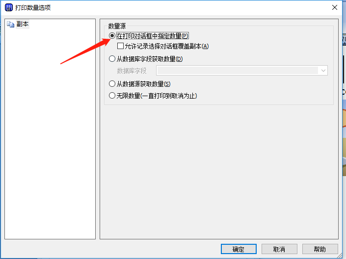

## 进纸

请参考机器盖上的提示，并严格执行

## 设置

* 如打印内容偏左，可以调整左侧偏移量：

* 如打印内容教模糊，可以调整打印浓度至20-25之间

* 如打印内容图片不够清晰或太黑，可以调整图片抖动

## 如何取消所有任务

长按机器上的Cancel按钮，直至出现“取消所有打印”后松手即可

## 测试打印

* 大贴纸模板

* 小贴纸模板

## 官网

[official website ](http://www.zebra-barcode.cn/printer/Zebra-ZT411.html)

[驱程下载](https://www.zebra.cn/us/en/support-downloads/printers/passive-rfid/zt411.html)

## 常见问题

[显示屏上不显示ZT系列打印机标签计数器（打印X/X)](https://supportcommunity.zebra.cn/s/article/ZT-Series-Printer-Label-Counter-Printing-x-of-x-is-not-present-on-display)
